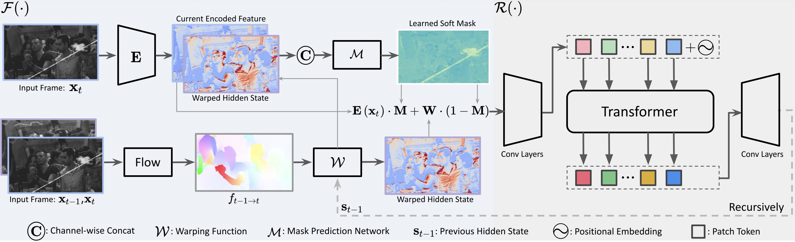

# Bringing Old Films Back to Life

https://user-images.githubusercontent.com/5800781/160990475-da5eff1d-adfe-47c6-a448-0ad035074e6b.mp4

### [Project Page](http://raywzy.com/Old_Film/) | [Paper (ArXiv)]() | [Supplemental Material]()

**This repository is the official pytorch implementation of our CVPR 2022 paper, *Bringing Old Films Back to Life*.**

[Ziyu Wan](http://raywzy.com/)<sup>1</sup>,
[Bo Zhang](https://bo-zhang.me/)<sup>2</sup>,
[Dongdong Chen](http://www.dongdongchen.bid/)<sup>3</sup>,
[Jing Liao](https://liaojing.github.io/html/)<sup>1</sup> <br>
<sup>1</sup>City University of Hong Kong, <sup>2</sup>Microsoft Research, <sup>3</sup>Microsoft Cloud AI


## :star2: Pipeline


## Requirements

Please install the dependencies according to ```environment.yml```.

## Usage

Clone the repository
```
git clone https://github.com/raywzy/Bringing-Old-Films-Back-to-Life.git
```

Download the relabled scratch templates for the video degradation model. [Download](https://portland-my.sharepoint.com/:u:/g/personal/ziyuwan2-c_my_cityu_edu_hk/EcB_8dZTgW1HsdAIOMtuz4QBLxk93oEWorHpcMC9KNy0Aw?e=mRXTbW)

REDS dataset could be directly downloaded from [Link](https://seungjunnah.github.io/Datasets/reds.html).

To train a model, remember to modify the config file following the example ```config_example/config.yaml```.

> *NOTE*: 
>  Modify both "train.dataroot_gt" and "train.dataroot_lq" into the path of clean training frame since the degradation is generated on-the-fly.
>
>  Modify "val.dataroot_gt" and "val.dataroot_lq" to the path of validation video clips.
>
>  Set "texture_template" to the path where you download the scratch templates.

Then you could run
```
CUDA_VISIBLE_DEVICES=0 python VP_code/main_gan.py --name RNN_Swin_4 --model_name RNN_Swin_4 --epoch 20 --nodes 1 --gpus 1 --discriminator_name discriminator_v2 --which_gan hinge
```

You could enable "--fix_flow_estimator" which freezes the flow-estimation network to make the training more stable.


## :notebook_with_decorative_cover: Citation

If you find our work useful for your research, please consider citing the following papers :)
```bibtex
@article{wan2022oldfilm,
  title={Bringing Old Films Back to Life},
  author={Wan, Ziyu and Zhang, Bo and Chen, Dongdong and Liao, Jing},
  journal={CVPR},
  year={2022}
}
```
Want to restore the old photos as well? Try and cite our **old photo restoration** algorithm [here](https://github.com/microsoft/Bringing-Old-Photos-Back-to-Life). 
```bibtex
@inproceedings{wan2020bringing,
title={Bringing Old Photos Back to Life},
author={Wan, Ziyu and Zhang, Bo and Chen, Dongdong and Zhang, Pan and Chen, Dong and Liao, Jing and Wen, Fang},
booktitle={Proceedings of the IEEE/CVF Conference on Computer Vision and Pattern Recognition},
pages={2747--2757},
year={2020}
}
```
Powerful [Image Completion Transformer](https://github.com/raywzy/ICT) (ICT), which could effectively recover the masked regions.
```bibtex
@article{wan2021high,
  title={High-Fidelity Pluralistic Image Completion with Transformers},
  author={Wan, Ziyu and Zhang, Jingbo and Chen, Dongdong and Liao, Jing},
  journal={arXiv preprint arXiv:2103.14031},
  year={2021}
}
```
## :bulb: Acknowledgments

*We would like to thank anonymous reviewers for their constructive comments.*

## :incoming_envelope: Contact

This repo is currently maintained by Ziyu Wan ([@Raywzy](https://github.com/raywzy)) and is for academic research use only. Discussions and questions are welcome via raywzy@gmail.com. 
